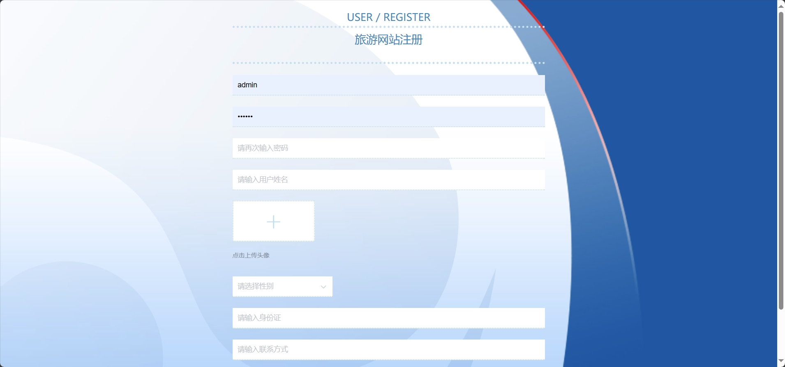
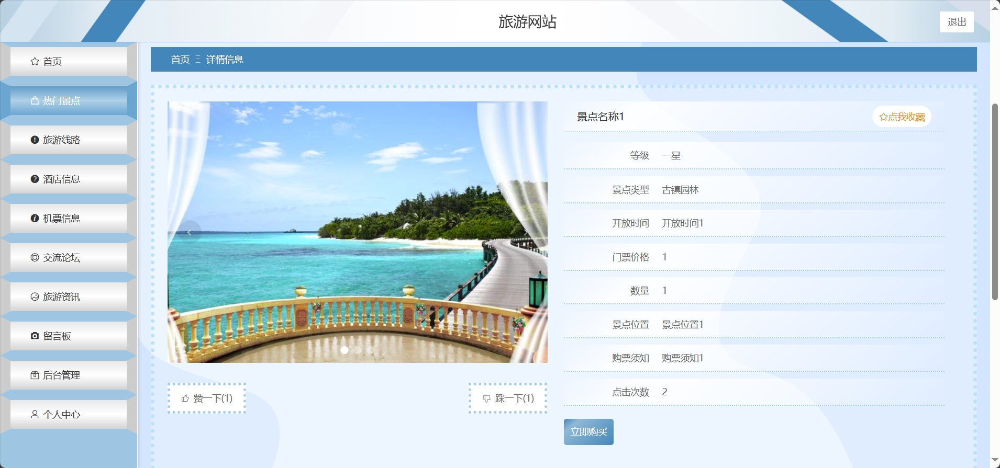
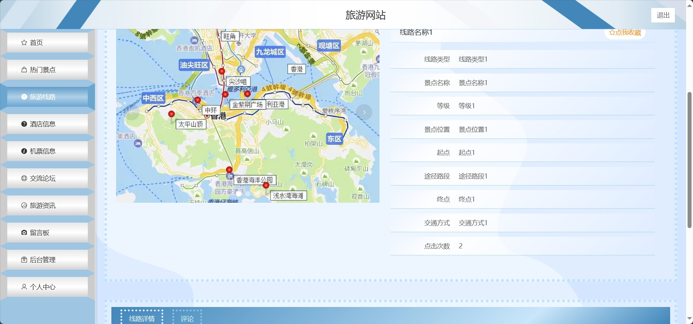
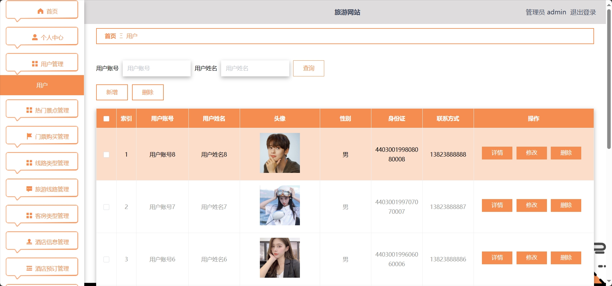
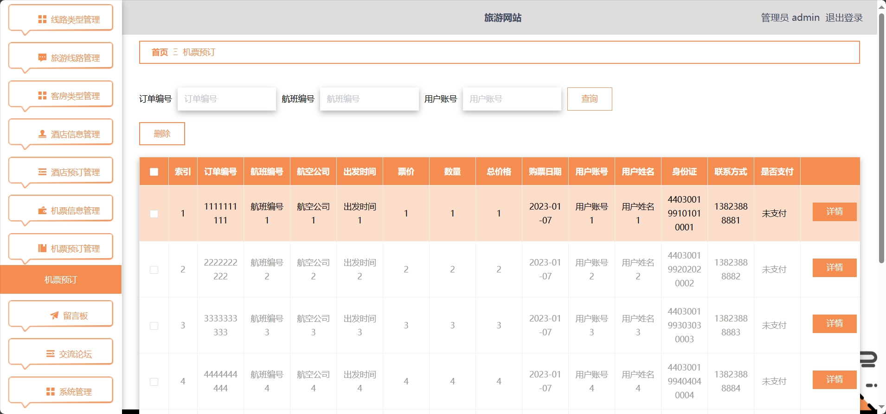

<h1 align="center">基于SSM的旅游景点购票管理系统</h1>

 获取sql文件 QQ: 605739993 QQ群: 377586148 

 [个人站点: 从戎源码网](https://armycodes.com/)

## 简介

> 本代码来源于网络,仅供学习参考使用!
>
> 提供1.远程部署/2.修改代码/3.设计文档指导/4.框架代码讲解等服务
>
> 管理端首页：http://localhost:8081/
>
> 管理员: admin 密码: 123456
>
> 用户端首页：http://localhost:8080/springbootv9oyf/front/dist/index.html#/index/home
>
> 用户：用户账号1 密码: 123456

## 项目介绍

基于SSM的旅游景点购票管理系统：前端 Vue、ElementUI，后端 SpringBoot、Mybatis，系统角色分为：管理员和用户，管理员在管理后台管理景点，对公告进行发布，添加新酒店分类、对相应数据进行统计、回复评论等；用户根据景点进行票务购物以及酒店预订等。主要功能如下：

### 启动方式

- 前端：

> cd src\main\resources\admin\admin
>
> npm install
>
> npm run serve

- 后端：

> 按钮启动 | 右键run SpringbootSchemaApplication

### 管理员：

- 基本操作：登录、修改密码、修改个人信息、上传图片、获取个人信息、回复评论
- 热门景点管理：获取热门景点列表、筛选热门景点信息、新增热门景点信息、删除热门景点信息、编辑热门景点信息、查看评论、回复评论、查看景点信息详情
- 门票购买管理：获取门票订单列表、筛选门票订单信息、删除门票订单信息、编辑门票订单信息、查看门票订单信息详情、景点销售统计、景点类型统计
- 线路类型管理：获取线路类型列表、筛选线路类型信息、新增线路类型信息、删除线路类型信息、编辑线路类型信息、查看线路类型信息详情
- 旅游线路管理：获取旅游线路列表、筛选旅游线路信息、新增旅游线路信息、删除旅游线路信息、编辑旅游线路信息、查看旅游线路信息详情、查看评论、回复评论
- 客房类型管理：获取客房类型列表、筛选客房类型信息、新增客房类型信息、删除客房类型信息、编辑客房类型信息、查看客房类型信息详情
- 酒店信息管理：获取酒店列表、筛选旅游线路信息、新增旅游线路信息、删除旅游线路信息、编辑旅游线路信息、查看旅游线路信息详情、查看评论、回复评论
- 酒店预订管理：获取酒店预订订单列表、筛选酒店预订订单信息、删除酒店预订订单信息、编辑酒店预订订单信息、查看酒店预订订单信息详情、酒店业绩信息统计
- 机票信息管理：获取机票列表、筛选机票信息、新增机票信息、删除机票信息、编辑机票信息、查看机票信息详情
- 机票预订管理：获取机票预订订单列表、筛选机票预订订单信息、删除机票预订订单信息、编辑机票预订订单信息、查看机票预订订单信息详情、机票业绩信息统计
- 留言板管理：获取留言板列表、查看留言板信息详情、删除留言板信息、回复留言信息、编辑留言板信息
- 论坛管理：获取论坛列表、查看论坛信息详情、删除论坛信息、查看论坛评论、回复论坛留言、新增论坛内容
- 轮播图管理：获取轮播图列表、修改轮播图内容、查看轮播图详情
- 资讯管理：获取资讯列表、筛选资讯信息、删除资讯信息、发布资讯、修改资讯内容、删除资讯信息
- 用户管理：获取用户列表、筛选用户信息、修改用户信息、删除用户信息、添加用户信息、查看用户信息详情

### 用户：

- 基本操作：登录、注册、修改个人信息、上传图片、获取个人信息、获取轮播图、留言、回复留言、修改密码、收藏
- 热门景点模块：获取景点列表、收藏景点信息、查看景点信息详情、评论景点、点赞、拉踩、筛选景点信息、购票
- 旅游路线模块：获取旅游路线列表、收藏旅游路线信息、查看旅游路线信息详情、评论旅游路线、筛选旅游路线信息
- 酒店模块：获取酒店列表、收藏酒店信息、查看酒店信息详情、评论酒店、筛选酒店信息、预订
- 机票模块：获取机票列表、查看机票信息详情、筛选机票信息、预订
- 交流模块：获取交流列表、筛选交流信息、发布帖子、评论帖子、删除帖子
- 资讯模块：获取资讯列表、筛选资讯信息、查看资讯详情
- 订单模块：获取订单列表、删除订单、下单、支付、查看订单详情、筛选订单信息

## 环境

- <b>IntelliJ IDEA 2020.3</b>

- <b>Mysql 5.7.26</b>

- <b>NodeJs 14.17.3</b>

- <b>Maven 3.6.3</b>

- <b>JDK 1.8</b>

## 运行截图

